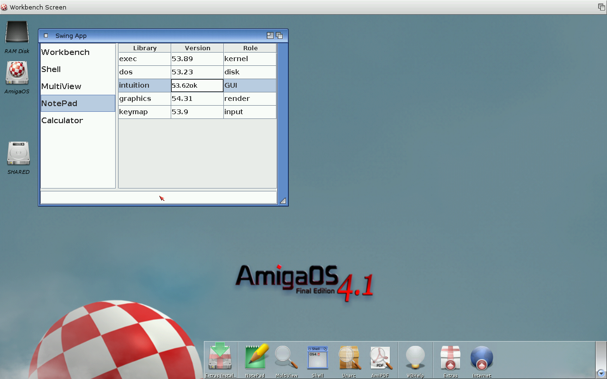

# Java-OS4


**A Java 8 runtime for AmigaOS 4 (PowerPC) — JamVM 2.0 + the OpenJDK 8 class
library, with a native AWT/Swing toolkit so Java GUIs run in Workbench windows.**

> **Beta.** Java-OS4 runs real headless and Swing applications, but it is still
> under active development — expect rough edges, gaps, and changes between
> releases. Bug reports and feedback are welcome.



Java-OS4 brings a real, modern-enough Java to 32-bit big-endian PowerPC
AmigaOS 4: it runs ordinary Java 8 `.jar` files — collections, streams and
lambdas, NIO, reflection, serialization — and renders Swing user interfaces
through Intuition and `graphics.library`. It is built by **reviving and
extending the [JAmiga](#acknowledgements) prior art** rather than starting from
scratch.

---

## Status

| Phase | Scope | State |
|------:|-------|-------|
| 0 | Vendor sources + cross-build environment | ✅ Done |
| 1 | JamVM engine bring-up (Hello World) | ✅ Done |
| 2 | OpenJDK 8 class library integration (`java -version`, headless) | ✅ Done |
| 3 | Headless conformance — io/nio/util/text/zip/reflection, threads + GC | ✅ Done (48/48 tests) |
| 4 | AWT/Swing GUI — Intuition windows, Java2D, real input, dialogs | ✅ Done |
| 5 | Packaging, polish, performance | 🚧 In progress (first release: **0.5.0**) |

The current release runs headless Java 8 programs and Swing applications
(windows, widgets, mouse, keyboard, resize, modal dialogs) in Workbench
windows. See [`docs/`](docs/) for screenshots of each milestone.

## Features

- **Engine:** JamVM 2.0 — an inline-threaded / stack-caching interpreter,
  retargeted to AmigaOS 4 PowerPC.
- **Class library:** the full OpenJDK 8 runtime (`rt.jar` and friends), so real
  Java 8 application compatibility — not a subset.
- **C runtime:** [clib4](#acknowledgements) (pthreads, `mmap`, `dlopen`).
- **GUI:** a [Caciocavallo](https://en.wikipedia.org/wiki/Caciocavallo)-style
  AWT toolkit (`sun.awt.amiga`) — only top-level windows get native peers
  (Intuition windows backed by an ARGB framebuffer blitted with
  `graphics.library`); every widget inside is a Swing lightweight painted by
  Java2D. Fonts via FreeType.
- **Zero-flag GUI launch:** `java -cp app.jar Main` starts a Swing app with no
  special options — the Amiga toolkit is the platform default.

## Quick start

A packaged release is an `.lha` containing a `Java-OS4` installer drawer.
**Download the latest from the
[Releases page](https://github.com/derfsss/java-os4/releases)**, or build it from
source (see [Building from source](#building-from-source) below). Per-release
changes are listed in [`CHANGELOG.md`](CHANGELOG.md).

> **0.5.4** fixes the `sun.boot.class.path` separator on AmigaOS: Swing apps and
> the test suite no longer pop a *"Please insert volume niopatch.zip"* requester
> or crash with *"Trampoline must not be defined by the bootstrap class loader"*
> (amigans.net report). Upgrading is recommended for anyone on 0.5.1–0.5.3.

**Requirements:**

- **AmigaOS 4** (PowerPC). Swing/AWT GUIs additionally need **`graphics.library`
  V52+** and `intuition.library` (standard on current AmigaOS 4); headless
  programs do not.
- **`clib4.library` 2.1 or newer** in `LIBS:` — the C runtime the VM depends on.
  The installer copies the bundled copy there if it is missing (get the latest
  from [clib4](https://github.com/AmigaLabs/clib4) to update it).
- The installer runs under **`Sys:Utilities/Installation Utility`** (AmigaOS 4.1).

1. Unpack it anywhere on your AmigaOS 4 machine.
2. Double-click the **Java-OS4** drawer icon to launch the installer (it runs
   under `Sys:Utilities/Installation Utility`). The wizard asks where to install
   the runtime, copies it there, adds a permanent `JAVA:` assign to
   `S:User-Startup` (live immediately, no reboot needed), and copies the `java`
   launcher to `C:` so it runs from any Shell.
3. Run programs from a Shell — the release bundles runnable examples:

   ```
   java -version
   java -cp examples/HelloJava.jar HelloJava   ; headless demo
   java -cp examples/SwingDemo.jar  SwingDemo   ; Swing demo
   java -cp examples/testsuite.zip  VmSuite     ; self-test
   ```

   Swing/AWT applications need no extra flags. Application classpath entries are
   resolved from the `JAVA:` drawer; reference jars elsewhere by absolute path.

> `javac` is not included — compile on a host JDK 8 (use **`javac --release 8`**)
> and copy the `.jar` over. Bytecode newer than Java 8 is rejected up front with
> `UnsupportedClassVersionError` rather than failing mysteriously at run time.

## Building from source

The toolchain runs in a Docker image — the AmigaOS 4 PowerPC cross compiler plus
a host JDK 8 — driven by the `Makefile`:

```sh
git submodule update --init     # check out the clib4/ submodule (or clone --recursive)
make vendor                     # fetch the JamVM + IcedTea 8 upstream sources, once
make image                      # build the cross-build image (pulls the public
                                #   walkero/amigagccondocker base), once
make build                      # clib4 + VM + native libraries + AWT toolkit
make dist                       # assemble the install tree + the .lha release
                                #   -> build/JavaOS4-<ver>.lha
```

`make release` does `build` then `dist` in one step; `make help` lists every
target. The clib4 C runtime is the in-repo **`clib4/` git submodule**
(`AmigaLabs/clib4`, `development`), built by `make clib4` automatically. The
larger JamVM + OpenJDK 8 (IcedTea) upstream trees are public but not committed
here — `make vendor` fetches them (see
[docs/BUILDING.md](docs/BUILDING.md) for the full source-acquisition flow). No
external paths are needed.

Full instructions, the build-script order, and how to run on QEMU or hardware
are in **[docs/BUILDING.md](docs/BUILDING.md)**.

## How it works

```
        Java apps (.class/.jar)  +  Swing
                          |
        OpenJDK 8 class library (rt.jar) + native libs
                          |
   AWT toolkit: sun.awt.amiga peers -> Intuition + graphics.library V52+
                          |
        JamVM 2.0  (libjvm.so: interpreter + GC + JNI)
                          |
   os/amiga glue: pthreads, dll loading, exception proxy, callNative
                          |
        clib4  on  AmigaOS 4 exec/dos/intuition/graphics  (PPC32 BE)
```

The key engineering work (cooperative GC safepoints, the Amiga path model, native
symbol resolution via clib4's shared-library model, the AWT peer design) lives in
the `src/` tree; build and run instructions are in
[`docs/BUILDING.md`](docs/BUILDING.md).

## Repository layout

```
src/amigaawt/     the sun.awt.amiga AWT toolkit (Java peers + JNI)
src/niopatch/     NIO.2 provider patch for the Amiga path model
src/fontconfig/   minimal fontconfig.properties for the font pipeline
src/tools/        small native helpers (e.g. an input injector for GUI tests)
tests/            self-verifying conformance + GUI test programs
tools/            Docker image + build/package scripts
docs/             notes, screenshots, and the JamVM vendor patch
```

The upstream JamVM / OpenJDK trees are not committed here; the AmigaOS 4 changes
to JamVM are carried as a patch at
[`docs/jamvm-amiga-openjdk.patch`](docs/jamvm-amiga-openjdk.patch).

## Acknowledgements

Java-OS4 stands on a great deal of prior work, with gratitude:

- **[JAmiga](https://github.com/jaokim/jamiga)** by **jaokim** — the
  Java-on-Amiga effort this project revives and extends. The AmigaOS 4 JamVM
  port and the IcedTea 8 build harness are the foundation we built on.
- **[JamVM](https://jamvm.sourceforge.net/)** by **Robert Lougher** — the
  compact, fast Java virtual machine at the core. (GPLv2)
- **[OpenJDK](https://openjdk.org/)** and **[IcedTea](https://icedtea.classpath.org/)**
  — the Java 8 class library and build tooling. (GPLv2 with Classpath Exception)
  The class-library bytecode used at runtime comes from
  **[Eclipse Temurin](https://adoptium.net/) 8**.
- **[clib4](https://github.com/AmigaLabs/clib4)** — the modern AmigaOS 4 C
  runtime (pthreads, `mmap`, `dlopen`) this build targets.
- **[GNU Classpath](https://www.gnu.org/software/classpath/)** — used as the
  engine bring-up stepping stone in Phase 1. (GPLv2 with Classpath Exception)
- **AmigaOS 4** and its SDK — `intuition.library`, `graphics.library` V52+,
  `keymap.library`, and the PowerPC toolchain.
- The **OpenJDK Caciocavallo** project, whose peer-toolkit design informs the
  `sun.awt.amiga` approach.

## License

Java-OS4 is distributed under the **GNU General Public License, version 2** —
see [LICENSE](LICENSE). This matches JamVM (GPLv2); the OpenJDK-derived parts
carry the GPLv2 **Classpath Exception**. Original source in this repository
(`src/`, `tools/`, `tests/`) is GPLv2-compatible; the AWT toolkit and other
class-library-adjacent code additionally grant the Classpath Exception, as noted
in their file headers.

When redistributing a built release you are combining GPLv2 (JamVM) and
GPLv2-with-Classpath-Exception (OpenJDK) components; the result is governed by
the GPLv2.
